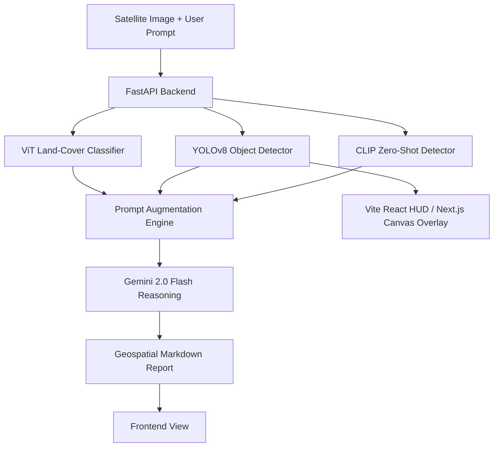

# Vision Based LLM for Extracting Information of Satellite Imagery

A hybrid Multimodal Geospatial Intelligence (GEOINT) system that bridges the gap between complex satellite imagery and natural language insights. By combining specialized computer vision models with a Large Multimodal Model (LMM), the system enables conversational query answering, object detection, and land-cover classification on satellite and aerial data.

---

## 🔗 Repository
* **GitHub Repository:** [Mujtaba-124/FYP_Extracting_Information_of_Satellite_Imagery](https://github.com/Mujtaba-124/FYP_Extracting_Information_of_Satellite_Imagery)

---

## 👥 Project Team & Supervision
* **Submitted By:**
  * Mujtaba Rasheed Malik (22F-BSAI-105)
  * Muhammad Danish (22F-BSAI-84)
  * Asad Ullah (22F-BSAI-53)
  * Jawad Ali (22F-BSAI-97)
* **Supervised By:** Engr. Bushra Shaikh
* **Institution:** Department of Artificial Intelligence, Dawood University of Engineering and Technology

---

## 🌟 Key Features
* **Land-Cover Classification (ViT):** Fine-tuned Vision Transformer (ViT-B/16) model trained on the EuroSAT dataset to categorize satellite scenes into 10 classes with high accuracy.
* **Object Detection (YOLOv8):** Custom YOLOv8 Nano model trained to localize 11 classes of geospatial objects (buildings, roads, vehicles, etc.) with extremely low latency (< 5ms).
* **Open-Vocabulary Semantic Detection (CLIP):** Utilizes OpenAI CLIP to detect arbitrary, unseen objects (e.g., "greenhouse", "solar panel") without retraining.
* **Conversational AI Report Generation (Gemini 2.0 Flash):** Integrates Gemini 2.0 Flash as the central reasoning engine that processes the image and model outputs to write structured geospatial intelligence reports.
* **Dual-Dashboard Frontend:**
  * **Next.js Command Center:** A strategic-level dashboard with 3D Earth Globe rendering, analytics, and generated reports.
  * **Vite React HUD:** A tactical-level real-time interface with drag-and-drop, neural scan animation, and interactive neon bounding box overlays on an HTML5 canvas.
* **FastAPI Backend:** Built with FastAPI to handle concurrent model inference, GPU acceleration, and API response caching.

---

## 🛠️ System Architecture

The following diagram illustrates how the models execute in parallel and how their predictions are fused together for Gemini's reasoning step:

---

## 📊 Technical Highlights & Metrics

### 1. Vision Transformer (ViT-B/16)
* **Dataset:** EuroSAT (27,000 geo-referenced Sentinel-2 image patches, 13 spectral bands).
* **Performance:** Achieved **92.3% accuracy** on land-cover classification.
* **Inference:** Sub-second execution on GPU hardware.

### 2. YOLOv8 Nano Object Detector
* **Classes (11):** Buildings, Forest, House, Industrial, Lake, Pasture, Residential, Road, Tree, Crops, Vehicles.
* **Inference Speed:** **< 5ms latency**, optimized for real-time applications.
* **Model Size:** 6.2 MB.

### 3. Contrastive Language-Image Pre-Training (CLIP)
* **Model:** `clip-vit-base-patch32` from Hugging Face.
* **Vocabulary:** 20 pre-defined semantic labels grouped into 5 categories, enabling semantic search and zero-shot discovery of out-of-vocabulary elements.

### 4. Hybrid Integration Performance
* **Factual Grounding:** Extremely high (>95% reduction in LMM hallucination rates by grounding outputs in YOLO & ViT structured bounding boxes/classes).
* **End-to-End Latency:** 3.5 to 8.5 seconds (primarily constrained by Gemini API round-trip times).

---

## ⚙️ Environment Configuration

### Backend Stack
* **Runtime:** Python 3.10+
* **Core Frameworks:** FastAPI, PyTorch (CUDA-enabled), Ultralytics YOLOv8, Transformers (Hugging Face), OpenCV, Pydantic.
* **API Endpoints:**
  * `POST /analyze` - Orchestrates all four models (YOLO, ViT, CLIP, Gemini) for full report generation.
  * `POST /detect` - Directly returns YOLOv8 object detection coordinates and labels.
  * `GET /datasets` - Lists available satellite datasets.
  * `GET /status` - Health check.

### Frontend Stack
* **Next.js Dashboard:** React 18, TypeScript, Tailwind CSS, Three.js (React Three Fiber for 3D Globe).
* **Vite React HUD:** React 18, TypeScript, Tailwind CSS, Framer Motion (neural scan effects), Leaflet.js (map views).
